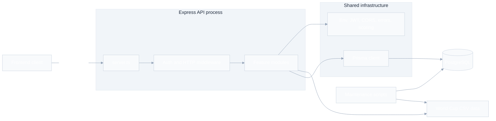

# Architecture

Bolao Backend is a TypeScript modular monolith built on Express, Prisma, and
PostgreSQL. The application keeps one deployable Node.js process while splitting
business capabilities into feature modules under `src/modules`.

## System diagram

The standalone Mermaid source is available in
[`docs/architecture.mmd`](./architecture.mmd).



## Runtime shape

`src/server.ts` is the application entrypoint. It creates the Express app,
applies CORS, JSON and URL-encoded body parsing, exposes `GET /health`, mounts
feature routers, and finishes with shared 404 and internal-error handlers.

The runtime route prefixes are:

- `/auth`
- `/matches`
- `/groups`
- `/ranking`
- `/users`
- `/champion-guess`
- `/rounds`
- `/admin`

Authentication uses JWT bearer tokens. `authenticate` verifies the token,
loads the current user through Prisma, and attaches `req.user`. `requireAdmin`
adds the role check used by the admin router.

## Module layout

Feature modules follow the same three-layer shape:

```txt
src/modules/<feature>/
  http/
    <feature>.routes.ts
    <feature>.controller.ts
    <feature>.schemas.ts
  services/
    <feature>.service.ts
  repositories/
    <feature>.repository.ts
```

Layer responsibilities:

- `http`: Express routing, controller methods, Zod request validation, response
  mapping, and HTTP status codes.
- `services`: use-case orchestration and business rules.
- `repositories`: Prisma queries, transactions, persistence mapping, and data
  access details.
- `shared`: infrastructure and cross-module utilities used by more than one
  module.

The intended dependency direction is:

```txt
HTTP routes/controllers -> services -> repositories -> Prisma -> PostgreSQL
```

Controllers should not call Prisma directly. Repositories should not know about
Express request or response objects.

## Feature responsibilities

- `auth`: registration, login, password hashing with bcrypt, JWT issuance, and
  global group membership after authentication flows.
- `matches`: match listing, team listing from World Cup CSV data, match lock
  calculation, pending guess alerts, and user guess upserts.
- `groups`: global group setup, user-created groups, group membership, member
  management, and group-scoped ranking.
- `ranking`: ranking aggregation and ordering from match points, champion
  points, exact scores, partial scores, and guess counts.
- `users`: current-user profile statistics, profile updates, password changes,
  recent guesses, and optional group position.
- `champion-guess`: champion-guess state, deadline handling, user submission,
  and official champion exposure.
- `rounds`: stage summaries, current-user history by stage, and stage-specific
  match views.
- `admin`: match creation and editing, score finalization, champion result
  finalization, user listing, user deletion, and role changes.

## Shared infrastructure

Shared code lives under `src/shared`:

- `config/env.ts` validates required environment variables with Zod.
- `database/prisma.ts` creates the Prisma client singleton.
- `auth/*` signs and verifies JWTs, defines authenticated-user types, and
  provides authentication middleware.
- `http/*` contains CORS and error handling helpers.
- `scoring/scoring.ts` contains match-point calculation, champion bonus points,
  and ranking normalization.

Cross-module calls should go through public module entrypoints when they are
needed. The current examples are `groups/index.ts` for global group membership
and `ranking/index.ts` for ranking construction.

## Data model

Prisma defines the persistence model in `prisma/schema.prisma`.

Core tables:

- `User`: participant account, role, accumulated match points, guesses, group
  memberships, owned groups, and champion guess.
- `Match`: World Cup match metadata, stage, status, score, and related guesses.
- `Guess`: one user's score prediction for one match.
- `Group` and `GroupMember`: private and global group membership with owner and
  member roles.
- `ChampionGuess`: one champion prediction per user and its bonus result.
- `AppConfig`: key-value application configuration, currently used for champion
  result state.

Match scoring gives 3 points for exact score and 1 point for correct outcome.
Champion guesses use the shared champion bonus value when the official champion
is saved.

## Supporting scripts and data

The `data/worldcup` directory stores the World Cup CSV dataset used by match
import and team listing flows.

Maintenance scripts live in `scripts`:

- `importWorldCupMatches.js` imports or updates matches from the World Cup CSV
  files.
- `recalculateScores.js` recalculates points for finished matches.

The application build uses `tsdown` with `src/server.ts` as the entrypoint and
emits the production server at `dist/server.mjs`.
